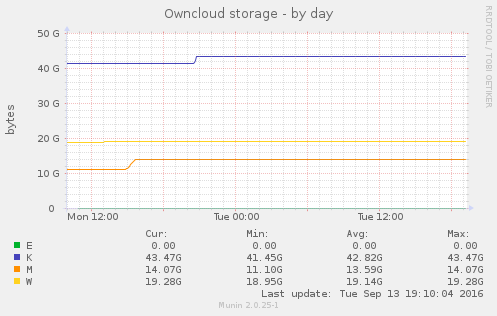
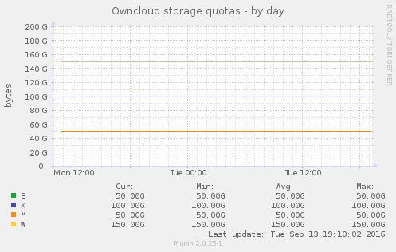
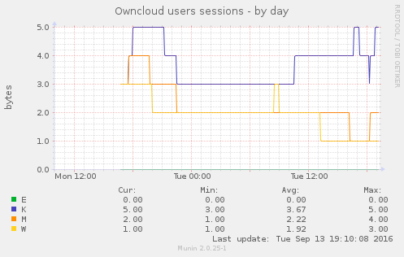

# MuninOwncloudPlugins
Simple Munin plugins for monitoring Owncloud

## Plugins
* `owncloud_storage` show the disk space usage per user (**size of the *file* folder only**, this does not include the content of *file_trashbin* or *file_versions* ones for instance).
* `owncloud_realstorage` show the disk space usage per user (**real size**, including the *file*, *file_trashbin*, *file_versions* and other working folders).
* `owncloud_quota` show the users quotas (*none* or *default* are shown as *0*)
* `owncloud_session` show the number of users opened sessions
* `owncloud_share` show the numbers of shares (shared files or folders) per user

## Configuration

Sample setup for '/etc/munin/plugin-conf.d/munin-node':
```
[owncloud_*]
env.dbuser owncloud
env.dbpassword password
env.dbname owncloud
```

`env.dbuser` can be any user having a SELECT right on the owncloud `env.dbname` database.
Or at least a SELECT right on the following tables:
* `owncloud_storage`: oc_users, oc_filecache, oc_mounts
* `owncloud_realstorage`: oc_users, oc_filecache, oc_mounts
* `owncloud_quota`: oc_users, oc_preferences
* `owncloud_session`: oc_users, oc_authtoken
* `owncloud_share`: oc_users, oc_share

The pulgins are currently assuming that the owncloud database is a MySQL one, on localhost and that owncloud uses *oc_* prefixed tables (see the list of tables above).
If you want to change that or make it configurable through env variables, feel free to contribute :).

## Samples






