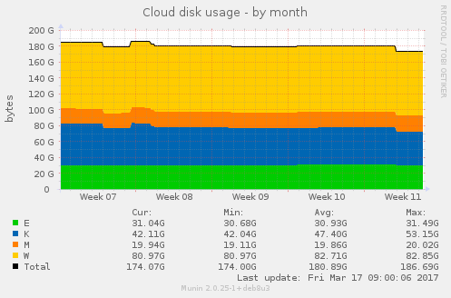

# MuninCloudPlugins
Simple Munin plugins for monitoring **Owncloud** (tested with Owncloud 9.1) or **Nextcloud** (it should be compatible with Nextcloud 9 and 10)

## Plugins
* `cloud_storage` show the disk space usage per user (**size of the *file* folder only**, this does not include the content of *file_trashbin* or *file_versions* ones for instance). Include a quota lookup per user (if a quota is set) and provide a critical thresholds trigger when 95% of the quota is reached (parametrizable through *env.quotaratio*). 
* `cloud_disk` show the disk space usage per user (**real size**, including the *file*, *file_trashbin*, *file_versions* and other working folders).
* `cloud_quota` show the users quotas (*none* or *default* are shown as *0*)
* `cloud_session` show the number of users opened sessions
* `cloud_share` show the numbers of shares (shared files or folders) per user

## Configuration

Sample setup for '/etc/munin/plugin-conf.d/munin-node':
```
[cloud_*]
env.dbuser owncloud
env.dbpassword password
env.dbname owncloud
env.dbtableprefix oc_
env.quotaratio 0.95
```

`env.dbuser` can be any user having a SELECT right on the `env.dbname` database used by Owncloud/Nextcloud.
Or at least a SELECT right on the following tables:
* `cloud_storage`: oc_users, oc_filecache, oc_mounts, oc_preferences
* `cloud_disk`: oc_users, oc_filecache, oc_mounts
* `cloud_quota`: oc_users, oc_preferences
* `cloud_session`: oc_users, oc_authtoken
* `cloud_share`: oc_users, oc_share

The pulgins are currently assuming that the owncloud database is a MySQL one, on localhost. The table prefix can changed using `env.dbtableprefix` (by default, it's the owncloud default one which is used: *oc_*).

## Samples

### Graphs

**cloud_disk:**



**cloud_session:**


**cloud_storage:**


### Graph informations

**cloud_storage:** (quota thresholds can be changed using `env.quotaratio`)


